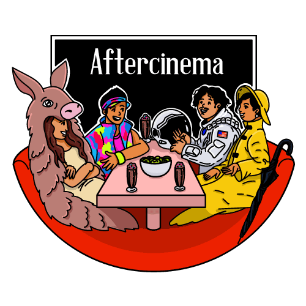

# Aftercinema

<p align="center">

</p>

## api

### local

```
cd api/app/source-code
pip install -r requirements.txt
uvicorn main:app
```

### prod

Copié sur le VPS et docker-compose lancé via [.github\workflows\deploy-api-to-vps.yml](.github\workflows\deploy-api-to-vps.yml).

Publié à [api.aftercinema.fr](https://api.aftercinema.fr).

## web-app

### local

Lancer le **Live Server** via VS Code sur la page HTML.

### prod

Publié à [aftercinema.fr](https://aftercinema.fr).
